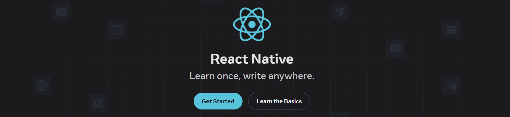

# 📱 React Native Mastery: Personal Learning Projects

   
  
   

  

    
  

  <h2>🧠 React Native Learning Journey with Real Projects</h2>
  

    Guided by tutorials from various sources and hands-on practice.
  

> **Personal repository to study React Native and related technologies by building real applications**.

---

## 📚 About This Repository

This is my **personal learning space**, focused on mastering **React Native** and related technologies like backend APIs, TypeScript, and mobile tooling... through hands-on practice.

Rather than reading docs or watching tutorials passively, I build real applications by following along with high-quality tutorials from the channels.

---

## 🚀 Stacks in Practice

Each project explores specific technologies and architectural patterns:

| Stack                   | Use Case                                   |
| ----------------------- | ------------------------------------------ |
| **TypeScript**          | Typed code for better developer experience |
| **React Native**        | Mobile development                         |
| **React.js**            | Web UI components and SPAs                 |
| **Next.js**             | Fullstack apps with SSR / API routes       |
| **NestJS**              | Backend services and REST APIs             |
| **Tailwind CSS**        | Styling across all apps                    |
| **Appwrite / Firebase** | Backend-as-a-Service, auth, storage        |
| **REST API**            | Real-world API integrations                |

---

## 🧠 Why This Approach?

✅ **Hands-On Learning**  
Learning by building real apps cements your understanding much better than reading docs alone.

✅ **Up-to-Date Stack**  
All technologies used here are in-demand and widely used in production environments.

✅ **Portfolio-Ready**  
These projects are not toy examples — they can be extended into real portfolio pieces or even MVPs.

---

## 🎯 Learning Goals

- Understand the React Native core ecosystem (navigation, state, styling)
- Practice TypeScript in mobile development
- Integrate real-world APIs and backend services
- Build reusable components and scalable project structures
- Learn to debug and test React Native apps

---

## 📺 What Guides This Journey

- Modern mobile development
- Real product-level projects
- React Native best practices
- TypeScript best practices
- Fullstack integrations

Highly recommended for any developer looking to build serious skills.

---

## 📎 Additional Notes

This repo will continue to grow as I explore more technologies and build more apps.

Contributions, suggestions, and feedback are always welcome!

---

## 🧾 License

This repository is for educational purposes. All tutorials are credited to their original creators.

✨ Learning in public. Building in public. Growing in public. ✨
